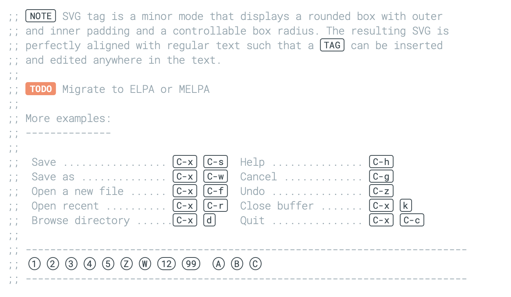
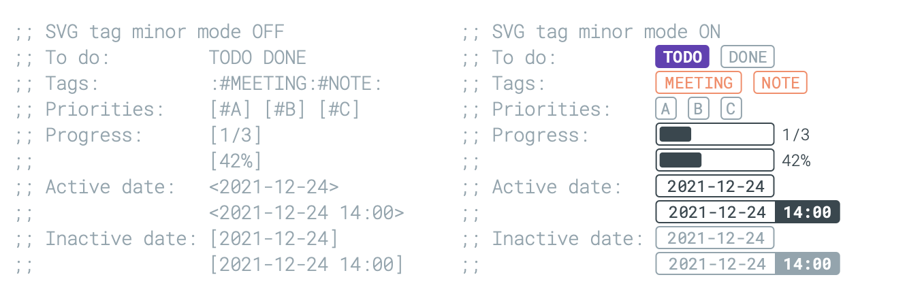

## svg-tag-mode

A minor mode to replace keywords or regular expression with SVG tags.

[](examples/example-1.el)

[](examples/example-2.el)


### Usage example

You need first to set `svg-tag-tags` that is a list of item here each
item has the form `(KEYWORD (TAG COMMAND HELP))` where:

- **KEYWORD** is a regular expression including a matched group of 
  the form `\\(xxx\\)`. If this is not the case the whole
  string will be used a the matched group.
- **TAG** is either a SVG image that will be displayed using the
  'display property or a function that accepts a unique string
  argument (match-string 1) and returns an SVG image.
- **COMMAND** is a command to be executed when user clicks on the tag.
  It can be nil if no command is associated with the tag.
- **HELP** is a string to be displayed when mouse pointer is over
  the tag. It can be nil if no command is associated with the tag.

then you can invoke mode with `M-x svg-tag-mode`. Here are some examples:


1. Replace any occurence of `:TODO:` with a static SVG tag displaying `TODO`

```lisp
(setq svg-tag-tags
      '((":TODO:" . ((lambda (tag) (svg-tag-make "TODO"))))))
```

2. Replace any occurence of `:HELLO:` with a static SVG tag displaying
   `HELLO` that can be clicked to execute the specified command. Help
   message is displayed when the tag is hovered with the pointer.

```lisp
(setq svg-tag-tags
      '((":HELLO:" .  ((lambda (tag) (svg-tag-make "HELLO"))
                       (lambda () (interactive) (message "Hello world!"))
                       "Print a greeting message"))))
```


3. Replace any occurence of `:TODO:` with a dynamic SVG tag displaying
   `:TODO:`

```lisp
(setq svg-tag-tags
      '((":TODO:" . ((lambda (tag) (svg-tag-make tag))))))
```

4. Replace any occurence of `:TODO:` with a dynamic SVG tag displaying `TODO`

```lisp
(setq svg-tag-tags
      '((":TODO:" . ((lambda (tag)
                       (svg-tag-make tag :beg 1 :end -1))))))
```

5. Replaces any occurence of `:XXX:` with a dynamic SVG tag displaying `XXX`

```lisp
(setq svg-tag-tags
      '(("\\(:[A-Z]+:\\)" . ((lambda (tag)
                               (svg-tag-make tag :beg 1 :end -1))))))
```

6. Replaces any occurence of `:XXX|YYY:` with two adjacent dynamic SVG
   tags displaying `XXX` and `YYY`

```lisp
(setq svg-tag-tags
      '(("\\(:[A-Z]+\\)\|[a-zA-Z#0-9]+:" . ((lambda (tag)
                                           (svg-tag-make tag :beg 1 :inverse t
                                                          :margin 0 :crop-right t))))
        (":[A-Z]+\\(\|[a-zA-Z#0-9]+:\\)" . ((lambda (tag)
                                           (svg-tag-make tag :beg 1 :end -1
                                                         :margin 0 :crop-left t))))))
```                                                         

7. This replaces any occurence of `:#TAG1:#TAG2:…:$` (`$` means end of
   line) with a dynamic collection of SVG tags. Note the `#` symbol in
   front of tags. This is mandatory because Emacs cannot do regex look
   ahead.
 
```lisp
(setq svg-tag-tags
      '(("\\(:#[A-Za-z0-9]+\\)" . ((lambda (tag)
                                     (svg-tag-make tag :beg 2))))
        ("\\(:#[A-Za-z0-9]+:\\)$" . ((lambda (tag)
                                       (svg-tag-make tag :beg 2 :end -1))))))
```                                       
